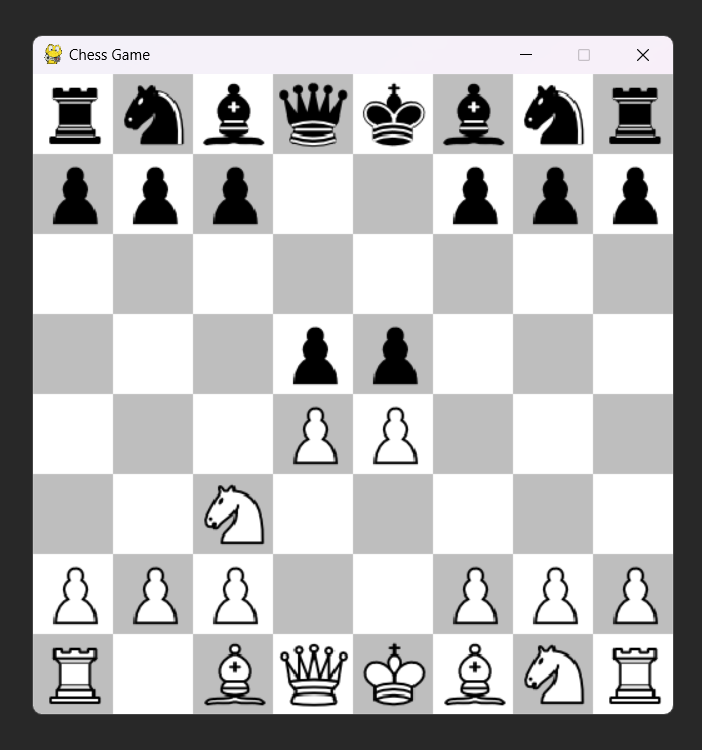

# 🏆 Pygame Chess Game

A simple chess game built using **Pygame**. The game allows users to select and move chess pieces on an 8x8 board.

## 🎮 Features
- Draws an **8x8 chessboard** with alternating colors.
- Displays **chess pieces** using images.
- Allows **piece selection and movement**.
- Runs at **20 FPS** for smooth performance.

## 📸 Screenshot
![Chess Game Preview]

##📂 File Structure

│── main.py           # Main game script
│── wkg.png           # White King piece image
│── bkg.png           # Black King piece image
│── (other piece images)
│── README.md         # This file

##🔧 Future Improvements
Implement legal chess moves.
Add drag-and-drop movement.
Improve piece capturing.
Add checkmate & game logic.
